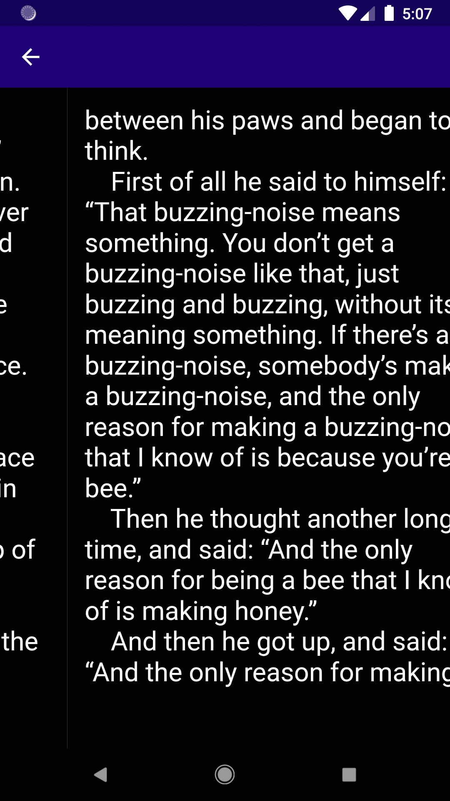
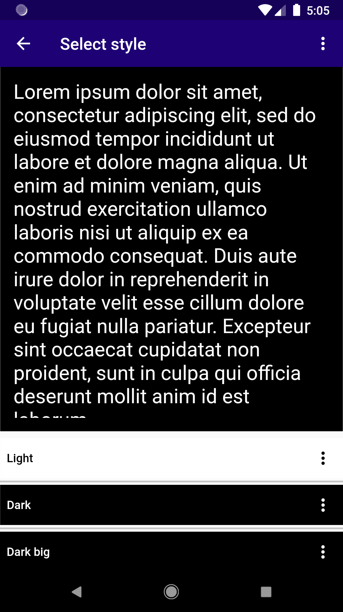
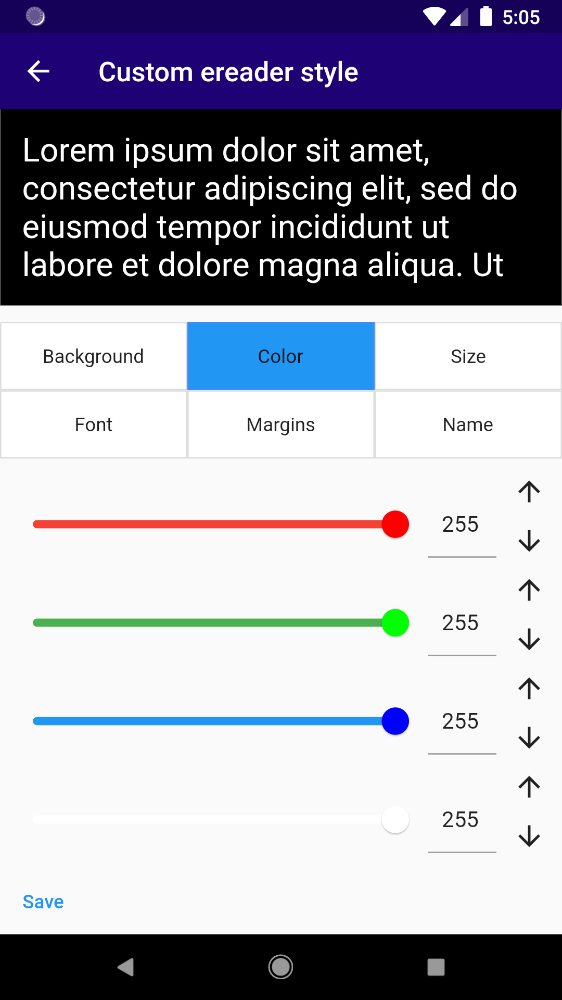
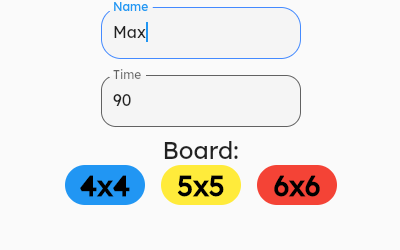
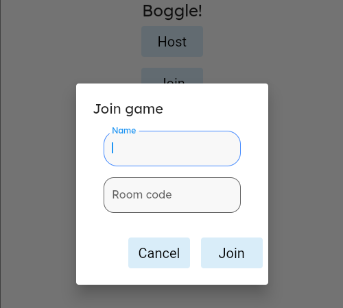
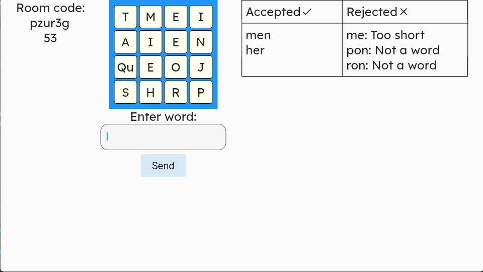
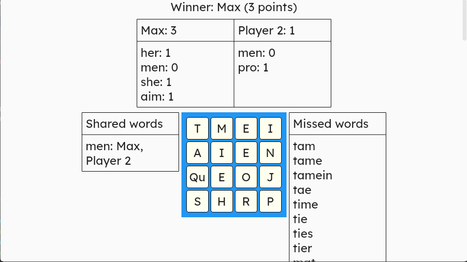
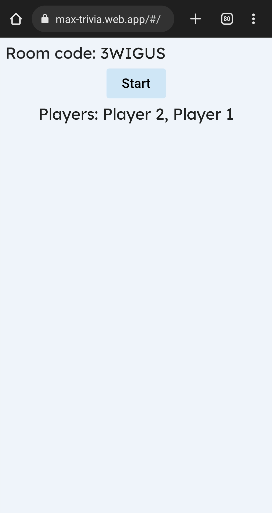
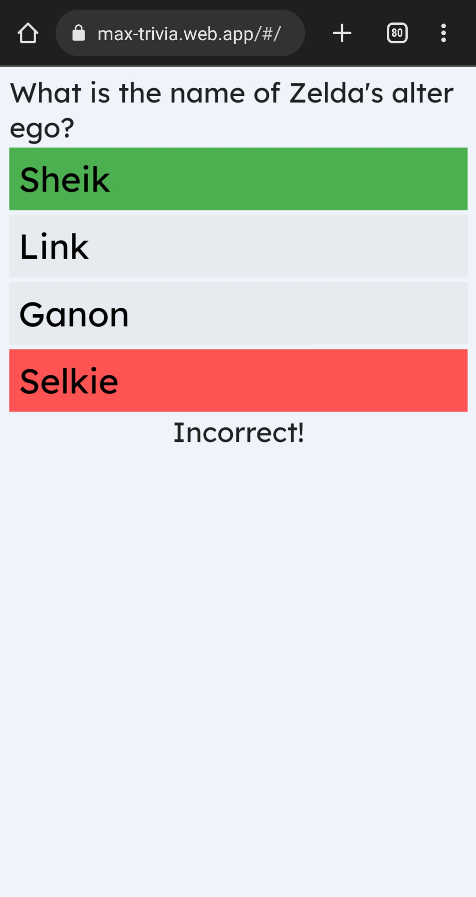
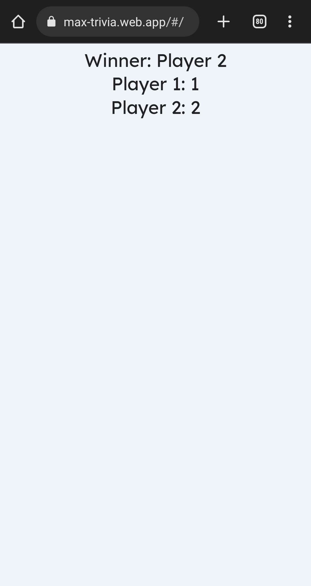

# Resume details of Max S. Haberman

While my [resume](/docs/resume.md) contains a summary of my accomplishments, this repository contains the details, including both accomplishments at work, and personal projects I have completed.

**Table of contents**

 * [Short resume](/docs/resume.md) ([single-page PDF](/docs/max_s_habermans_resume.pdf))
 * [Work experience](/docs/work-experience.md)
 * [Projects](/docs/projects.md) (includes links to all project repositories)

## Repositories

### eReader

|  |  |  |  |
|:--:|:--:|:--:|:--:|
| Downloading ebook | Turning page | Select style | Edit style |

 * [Client app](https://github.com/TheOmnimax/ereader)
 * [Backend server](https://github.com/TheOmnimax/ebook-server)
 * [Ebook uploader client app](https://github.com/TheOmnimax/ebook_uploader)

### Boggle

|  |  |
|:--:|:--:|
| Results | Results |

|  |  |
|:--:|:--:|
| Results | Results |

 * [Client app](https://github.com/TheOmnimax/boggle_flutter)
 * [Backend server](https://github.com/TheOmnimax/boggle-server)
 * [Word indexer](https://github.com/TheOmnimax/word-indexer)

### Trivia game

|  |  |  |  |
|:--:|:--:|:--:|:--:|
| Results | Results | Results | Results |

 * [Client app](https://github.com/TheOmnimax/max-trivia)
 * [Backend server](https://github.com/TheOmnimax/trivia-server)