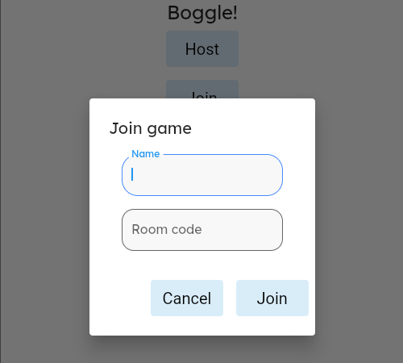
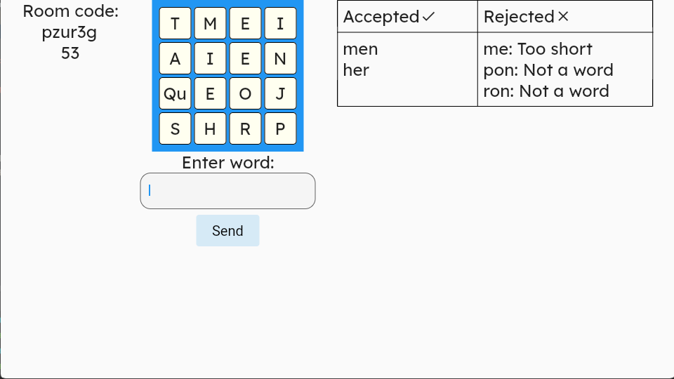
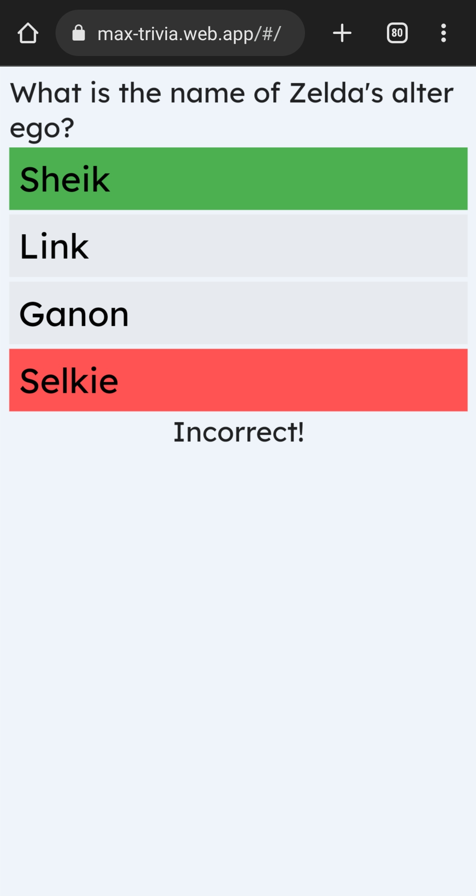

# Personal projects
These are apps and projects I created to demonstrate my skills as a full-stack developer. All three apps are Flutter apps (front-end using Dart) that communicate with a server (Google App Engine, built using Python).

**Table of contents**
 * [eReader](#ereader)
 * [Boggle](#boggle)
 * [Trivia game](#trivia-game)

## eReader

|  |  |  |  |
|:--:|:--:|:--:|:--:|
| Downloading ebook | Turning page | Select style | Edit style |

### Repositories

 * [Client app](https://github.com/TheOmnimax/ereader)
 * [Backend server](https://github.com/TheOmnimax/ebook-server)
 * [Ebook uploader client app](https://github.com/TheOmnimax/ebook_uploader)

### About

This is an eReader that takes an EPUB file (open-source ebook) and makes it readable. Users can open the book, read, and swipe through the pages to read the book.

This app uses the following:

 * General app development using Flutter (Dart)
 * Build a server (Python, hosted in Google Cloud App Engine)
 * Developed REST API server, built using Flask in Python, that allowed client to download books
 * Authentication using Firebase authentication (only logged-in users can download new books from the server)
 * Using libraries (used libraries capable of understanding EPUB files)
 * Created services epub parsing services that were not previously available

## Boggle

|  |  |
|:--:|:--:|
| Host game | Join game |

|  |  |
|:--:|:--:|
| Playing | Results |

### Repositories

 * [Client app](https://github.com/TheOmnimax/boggle_flutter)
 * [Backend server](https://github.com/TheOmnimax/boggle-server)
* [Word indexer](https://github.com/TheOmnimax/word-indexer)

### About

Game that multiple players can join and play remotely over the internet. When the timer starts, the letters on the game board are revealed, and players enter words. If a word is rejected, then it will let them know why it was rejected (too short, not a word, or not found). At the end of the game, it calculates scores, including dropping words shared between players, and then lists every single word that they missed, so they can learn for the future.

This app uses the following:

 * General app development using Flutter (Dart)
 * Build a server (Python, hosted in Google Cloud App Engine)
 * Real-time communication between clients over the internet using REST API polling built using Flask in Python
 * Algorithms (finding every possible word for each Boggle board using a depth-first search)

## Trivia game

|  |  |  |  |
|:--:|:--:|:--:|:--:|
| Results | Results | Results | Results |

### Repositories

 * [Client app](https://github.com/TheOmnimax/max-trivia)
 * [Backend server](https://github.com/TheOmnimax/trivia-server)

### About

Trivia game where players compete to answer trivia questions. The first player to answer gets the point. Time is theoretically unlimited, with the round ending either when a player selects the correct answer, or when all players select a wrong answer.

 * General app development using Flutter (Dart)
 * Build a server (Python, hosted in Google Cloud App Engine)
 * Real-time communication between clients over the internet using WebSockets (used Socket.io library)